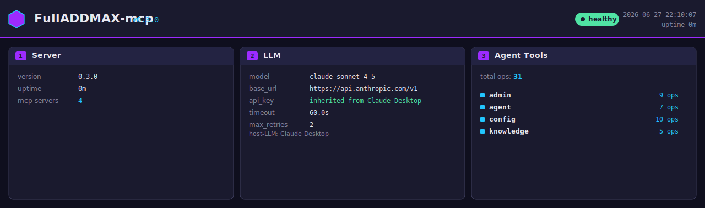

# FullADDMAX-mcp

> 多 Agent 编排 MCP Server / Multi-agent orchestration MCP server


[]()
[]()
[]()

FullADDMAX-mcp 把单个 AI Agent 变成一支团队。它通过 [Model Context Protocol](https://modelcontextprotocol.io/)（stdio）暴露 4 种经过实战打磨的多 Agent 工作流，让 Claude Desktop、Cursor、Trae、Continue.dev 等任何 MCP 客户端都能直接调度子代理、做并行研究、流水线处理、和 Agent 协作。

FullADDMAX-mcp turns a single AI agent into a team. It exposes four battle-tested multi-agent workflows over the [Model Context Protocol](https://modelcontextprotocol.io/) (stdio), so any MCP client (Claude Desktop, Cursor, Trae, Continue.dev, ...) can dispatch sub-agents, run parallel research, shard processing, and collaborate with handoffs out of the box.

<p align="center">
  
</p>

---

## ✨ 特性 / Features

#### 🛠 Tools

- **4 个 mega tool · 31 个 op** — `admin` (9) · `agent` (7) · `config` (10) · `knowledge` (5)
- **MCP stdio transport** — 直接被 Claude Desktop / Cursor / Trae / Continue.dev / Codex 加载

#### 🔌 LLM

- **Autodetect 优先级链** — `FULLADDMAX_*` → `OPENAI_*` → 宿主注入 (Claude / Cursor / Copilot) → 本地 (Ollama / vLLM / LM Studio)
- **OpenAI 兼容端点** — 任何 `/v1/chat/completions`，不绑定 provider
- **零配置离线 stub** — `FULLADDMAX_AGENT_OFFLINE=1` 时 7 个 agent op 全走 deterministic Markdown 框架，无 LLM、无网络

#### 🛡 Reliability

- **超时 + 重试 + 限流令牌桶** — 防止 LLM 限流和卡死（global + per-session）
- **Token 用量追踪** — 全自动记录每次调用的 prompt/completion token + 成本估算
- **持久化 session context** — Memory + SQLite 后端，跨调用可传递状态
- **🔍 可配置 logging** — level / format / file / rotation 全部走 CLI flag 或 env var，零额外依赖

#### 📦 Dev

- **零额外运行时依赖** — 只依赖 `mcp` + `httpx`
- **🎛 一键看板** — `fulladdmax-mcp panel` 生成单文件 SVG 仪表盘（3 张核心卡，纯 SVG 无 emoji）
- **7 个 agent 工作流** — orchestrator · parallel · map_reduce · swarm + auto_workflow · delegate · hive_run

---

## 🎛 工作面板 / Dashboard

`fulladdmax-mcp` 自带一个**纯 SVG 仪表盘**（无任何 emoji / 图片依赖），随时呼出看当前 server 状态：版本、uptime、LLM 配置（model / base_url / api_key / timeout / retries）、31 个注册 op 分布。一行命令生成单文件 SVG，可直接 `git commit` 进 README。

### 3 张核心卡

| 卡片 | 字段 | 含义 |
|------|------|------|
| **Server** | version · uptime · mcp servers | 健康检查 / 版本号 / 运行时间 |
| **LLM** | model · base_url · api_key · timeout · retries | 智能三态：真 key / 继承自宿主 / 开箱即用提示 |
| **Agent Tools** | total ops: 31 | 4 个 mega tool 各自的 op 数 (admin 9 / agent 7 / config 10 / knowledge 5) |

### 智能三态 / Smart 3-state

api_key 字段，缺省**不报警**：

| 情况 | api_key 单元格 | 颜色 | 副标题 |
|------|----------------|------|--------|
| 配了真 key | `sk-xxxx****`（脱敏）| 白 | — |
| 配了空 + 检测到宿主 | `inherited from <host>` | 绿 | `host-LLM: <host>` |
| 配了空 + 裸跑 | `(off-the-shelf)` | 灰 | `set FULLADDMAX_API_KEY to enable agent ops` |

> 没配 LLM 时 server 也能跑 `knowledge` / `config` / `admin`，并显示柔和的"off-the-shelf"标签。配了 LLM 后 4 个 mega tool 全可用（31 个 op）。

### 用法 / Usage

```bash
# 生成单文件 SVG
fulladdmax-mcp panel --out docs/panel.svg

# 实时预览（默认每 5 秒刷新）
fulladdmax-mcp panel --serve --port 8765 --refresh 5
# → 打开 http://127.0.0.1:8765/panel

# 静态预览页（纯展示，零按钮）
open docs/preview.html        # macOS
start docs\preview.html       # Windows
```

### 🔍 可配置 Logging / Configurable logging

5 个维度全部走 CLI flag 或 env var，**CLI 优先**，env var 次之，默认兜底。

| 维度 | CLI flag | env var | 默认 |
|------|----------|---------|------|
| Level | `--log-level` | `FULLADDMAX_LOG_LEVEL` | `INFO` |
| Format | `--log-format text\|json` | `FULLADDMAX_LOG_FORMAT` | `text` |
| File | `--log-file PATH` | `FULLADDMAX_LOG_FILE` | stderr |
| Rotate (bytes) | `--log-rotate-max-bytes N` | `FULLADDMAX_LOG_ROTATE_MAX_BYTES` | 0 (不轮转) |
| Rotate (backups) | `--log-rotate-backups N` | `FULLADDMAX_LOG_ROTATE_BACKUPS` | 3 |

**生产常用组合**：

```bash
# 开发：人类可读，开 DEBUG
fulladdmax-mcp --log-level DEBUG

# 生产：JSON 输出给 ELK / Loki / Datadog 解析
fulladdmax-mcp --log-format json

# 长期运行：写文件 + 自动轮转（10MB × 5 备份）
fulladdmax-mcp --log-file /var/log/fulladdmax-mcp.log \
               --log-rotate-max-bytes 10485760 \
               --log-rotate-backups 5

# 容器化部署：用 env var 注入，Docker/K8s 友好
FULLADDMAX_LOG_FORMAT=json FULLADDMAX_LOG_LEVEL=INFO fulladdmax-mcp
```

**JSON 输出样例**（每行一个 record，可直接 jq）：

```json
{"level":"INFO","logger":"fulladdmax-mcp.llm","message":"LLM configured","timestamp":"2026-06-28T14:00:42+0800","base_url":"https://api.openai.com/v1","model":"gpt-4o-mini"}
{"level":"WARNING","logger":"fulladdmax-mcp.rate_limit","message":"rate limit reached","timestamp":"2026-06-28T14:00:43+0800","current":105,"limit":100}
{"level":"ERROR","logger":"fulladdmax-mcp.llm","message":"chat_with_tools reached max_steps","timestamp":"2026-06-28T14:00:44+0800","max_steps":10,"exc_info":"Traceback..."}
```

**子 logger 全部走同一个 handler**（无重复输出）：12 个模块用 `getLogger(__name__)` 拿到的 logger（`fulladdmax_mcp.llm` / `fulladdmax_mcp.dispatcher` / ...）经 `propagate=True` 汇到 root 的唯一 handler。`configure_logging()` 幂等，调用 N 次也是单 handler。

**团队开发参考**：完整 env var 列表在 [.env.example](.env.example) — 复制成 `.env`（已 gitignore）后填值即可。包含 5 个 logging 维度 + 4 种 LLM 配置方案 + OFFLINE 开关 + host injection 说明。

### 实际效果 / What it looks like

直接 `fulladdmax-mcp panel --out docs/panel.svg` 生成的纯 SVG（1280×380 像素、原生 SVG 元素 = `rect` / `polygon` / `text` / `circle`，**无 emoji**、**无外部资源**）：


### 数据怎么来 / Where the data comes from

`panel` 通过**进程内调用 mega tool** 收集数据 —— 顺带也是 mega tool 链路的冒烟测试：

| 卡片 | mega tool 调用 |
|------|---------------|
| **Server** | `admin(operation="ping")` (version, uptime) |
| **LLM** | `admin(operation="ping")` (model, base_url, api_key, timeout, retries) |
| **Agent Tools** | `admin(operation="list_agent_tools")` (4 mega tool × op 数) |

> 任何 mega tool 报错都会被收集成 `unhealthy` 状态 + 健康指示变红，但**不会**让 SVG 渲染失败。

### 智能识别 host LLM / Smart host LLM detection

如果 `FULLADDMAX_API_KEY` 默认是空的，panel 会**自动扫环境变量**判断 server 是不是被宿主 AI 调起。识别规则（任一前缀命中即视为命中）：

| 宿主 AI | 识别的 env 前缀 |
|---------|-----------------|
| Claude Desktop / Claude Code | `CLAUDE_` / `ANTHROPIC_` / `CLAUDE_CODE` |
| Cursor | `CURSOR_` |
| Codex CLI | `CODEX_` / `OPENAI_CODEX_` |
| Continue.dev | `CONTINUE_` |
| GitHub Copilot | `COPILOT_` / `GITHUB_COPILOT_` |
| Cline | `CLINE_` |
| Aider | `AIDER_` |
| Zed | `ZED_` / `ZED_AGENT_` |

> Trae IDE 自身在 spawn MCP server 时会注入 `CLAUDE_CODE_*` env var，所以 `fulladdmax-mcp panel` 在 Trae 里直接跑就会显示「inherited from Claude Desktop」——你不用自己 export 任何东西。

---

## 🤖 Agent Workflows

`agent` mega tool 暴露 **7 个 op**，覆盖"独立子任务并行 / 多角度分析 / 流水线处理 / 自主分裂"四大场景。下面 3 个最常用：

### delegate — 启发式并行

当任务包含 **3+ 个独立子任务**（如"研究 A、B、C 三个市场"），让 AI 主动调 `delegate` 比按顺序一个一个跑快 N 倍——框架会**自动并行**派发 N 个 worker 同时干活。

```python
# 启发式切分（按标点 + and/then 拆）
agent(operation="delegate",
      params_json='{"task": "调研北京、上海、深圳三个城市的电动车市场"}')
# → 内部：3 个 worker 并行（max_parallel=5）

# 显式给出子任务
agent(operation="delegate",
      params_json='{"task": "对比 3 个数据库",
                    "children": ["Postgres", "MySQL", "SQLite"]}')

# 强制分裂 / 单 worker
agent(operation="delegate",
      params_json='{"task": "...", "split": "always"|"never"}')
```

| 参数 | 默认 | 含义 |
|------|------|------|
| `task` | — | 主任务（必填） |
| `children` | 自动启发式 | 预定义子任务列表（跳过启发式） |
| `split` | `"auto"` | `"auto"` / `"always"` / `"never"` |
| `max_depth` | `2` | 递归深度上限（子代理可继续 `delegate`） |
| `max_parallel` | `5` | 单层最大并发 worker 数 |

**启发式分隔符**：CJK `，。、；。` + EN `,` `.` `?` `!` `;` + ` and ` ` then ` ` & ` + 换行。

### 零 LLM 模式 / Offline stub

设 `FULLADDMAX_AGENT_OFFLINE=1` 后，**所有 7 个 agent op 都走 deterministic stub 路径**——无 LLM 调用、无网络、无 GPU，纯 Python 文本生成。

```bash
export FULLADDMAX_AGENT_OFFLINE=1
```

| op | 0 LLM 时行为 |
|----|------------|
| `orchestrator_run` | 1 planner 框架 + N worker 框架 + 1 synthesizer 框架 |
| `parallel_agents_run` | N 个 worker 框架（每个 task 一段） |
| `map_reduce_run` | map 阶段 N 个 item 框架 + reduce 阶段合并清单 |
| `swarm_run` | initial agent 框架 + handoff 链模板 |
| `auto_workflow` | **完全无 LLM**（纯启发式路由） |
| `delegate` | N 个 sub-agent 框架（heuristic split） |
| `hive_run` | 6 部门框架 × waves 波次 + 刑部批评回流说明 |

**三态行为**：

| 状态 | 行为 |
|------|------|
| 1. `FULLADDMAX_AGENT_OFFLINE=1` | **强制走 stub**（不依赖 LLM 状态） |
| 2. 没设 env + 没 LLM | 返 lazy-hint 文本（教程式） |
| 3. 配了 LLM | 走真 LLM 路径 |

→ **真正的"开箱即用"**：装完即用，不需 LLM、不需配置、不需联网。

### hive_run — 三省六部蜂巢

`delegate` 适合"独立子任务并行"；当任务是**"一个复杂事需要 N 个角度同时看"**时，调 `hive_run`：

| 部门 | 角度 |
|------|------|
| **吏部 (Personnel)** | 利益相关者、角色、决策点 |
| **户部 (Revenue)** | 成本、ROI、预算 |
| **礼部 (Protocol)** | 合规、伦理、UX、标准 |
| **兵部 (Defense)** | 风险、边缘 case、扩展性 |
| **刑部 (Justice)** | 红队、批评、找最弱假设 |
| **工部 (Engineering)** | 具体计划、里程碑、架构 |

```python
# 6 部门并行
agent(operation="hive_run",
      params_json='{"task": "设计一个全球支付系统"}')
# → wave 1: 6 minister 并行 → 刑部批评提炼为 feedback
# → wave 2: 6 minister 拿 feedback 重出
# → 12 子代理在 < 1 秒完成

# 3 波次 / 自定义部门 / 提预算
agent(operation="hive_run",
      params_json='{"task": "...",
                    "waves": 3,
                    "departments": ["marketing", "legal", "eng"],
                    "max_subagents": 500}')
```

**hive_run vs delegate**：

|  | `delegate` | `hive_run` |
|---|---|---|
| 拆分方式 | 启发式按 `,` `、` `and` 等拆 | 固定 N 部门，每部门看一个角度 |
| 适用任务 | 独立子任务（研究 A, B, C） | 一个事多角度（设计 + 风险 + 成本 + ...） |
| 反馈循环 | 无 | **有**（刑部批评→其他部门第 2 波） |
| 递归深度 | `max_depth=2` | `max_depth=null`（默认无限；可配） |
| 并发上限 | `max_parallel=5` | **无**（6 部门全部同时跑） |
| waves 上限 | N/A | **20 硬上限**（超过抛 `ValueError`，不静默截断） |

**三层硬保护**（按触发顺序）：`waves ≤ 20` → `max_depth` → `max_subagents = 200`。「没有数量限制」指的是**设计上不阻止 AI 自主扩展**，但工程上必须给异常路径留 3 道安全网——这是负责任的"自由"。

---

## 📦 安装 / Installation

```bash
# 克隆
git clone https://github.com/addxiaoyi/FullADDMAX-mcp.git
cd FullADDMAX-mcp

# 用 pip（推荐开发模式）
pip install -e ".[dev]"

# 或用 uv
uv pip install -e ".[dev]"
```

可选依赖 `dev` 包含 `pytest` / `pytest-asyncio` / `respx` / `ruff`，运行测试和 lint 需要。

---

## 🔧 配置 LLM / Configure LLM

支持任何 OpenAI 兼容的 `/v1/chat/completions` 端点。

### 方式 A：环境变量（推荐给服务化部署）/ Environment variables (recommended for servers)

| 变量 | 默认 | 说明 |
|------|------|------|
| `FULLADDMAX_BASE_URL` | `https://api.openai.com/v1` | OpenAI 兼容 base URL |
| `FULLADDMAX_API_KEY` | _(空)_ | API key |
| `FULLADDMAX_MODEL` | `gpt-4o-mini` | 模型名 |
| `FULLADDMAX_TEMPERATURE` | `0.7` | 采样温度 (0-2) |
| `FULLADDMAX_MAX_TOKENS` | `2048` | 单次响应最大 token |
| `FULLADDMAX_TIMEOUT` | `60` | 单次请求超时（秒）|
| `FULLADDMAX_MAX_RETRIES` | `2` | 5xx/网络错误重试次数 |

也支持 `OPENAI_API_KEY` 作为 `FULLADDMAX_API_KEY` 的兜底。

### 方式 B：运行时通过 MCP tool 配 / Configure at runtime via the MCP tool

调用一次 `configure_llm(base_url, api_key, model, ...)`，之后所有工作流都会用这个配置。

---

## 🧩 客户端集成 / Client Integration

### ⚡ 一键配置（推荐 / Recommended）

安装 server 时会自动附带 `fulladdmax-install` 命令。它能自动检测本机已装的 IDE 并写入正确配置。

```bash
pip install -e .

# 1) 看本机有哪些 IDE 被识别
fulladdmax-install --list

# 2) 装到 Claude Desktop + Cursor + Codex（自动跳过未装的）
fulladdmax-install \
  --base-url https://api.openai.com/v1 \
  --api-key sk-... \
  --model gpt-4o-mini

# 3) 只装到指定 IDE
fulladdmax-install --ide claude --api-key sk-...

# 4) HTTP 模式（指向已启动的 HTTP server）
fulladdmax-install --ide cursor --url http://127.0.0.1:8000/mcp

# 5) 预览不写文件
fulladdmax-install --ide cursor --api-key sk-... --dry-run

# 6) 卸载
fulladdmax-install --ide cursor --uninstall
```

支持的 IDE：`claude`、`cursor`、`trae`、`continue`、`codex`（逗号分隔多选）。参数 `--api-key` 也可省略，靠环境变量 `FULLADDMAX_API_KEY` 提供。卸载时 `--api-key` 等可省略。

输出示例：

```
  claude   installed  C:\Users\l\AppData\Roaming\Claude\claude_desktop_config.json (container_key=mcpServers)
  cursor   installed  C:\Users\l\.cursor\mcp.json                                  (container_key=mcpServers)
  codex    skipped    C:\Users\l\.codex\config.toml                               (no change)
```

---

### 手动配置（可选） / Manual config (optional)

> 所有命令都假设你把 `BASE_URL` / `API_KEY` / `MODEL` 替换成你自己的值；`fulladdmax` 是配置文件里这台 server 的显示名（可改成 `My-Agents`、`maxmcp` 等）。

---

### Claude Desktop

配置文件路径：

| OS | 路径 |
|----|------|
| macOS | `~/Library/Application Support/Claude/claude_desktop_config.json` |
| Linux | `~/.config/Claude/claude_desktop_config.json` |
| Windows | `%APPDATA%\Claude\claude_desktop_config.json` |

**macOS / Linux（bash / zsh）：**

```bash
CONFIG="$HOME/Library/Application Support/Claude/claude_desktop_config.json"
[ -f "$CONFIG" ] || CONFIG="$HOME/.config/Claude/claude_desktop_config.json"
mkdir -p "$(dirname "$CONFIG")"

# 用 jq 合并到已有配置，没有就新建
TMP=$(mktemp)
jq '.mcpServers += {
  "fulladdmax": {
    "command": "fulladdmax-mcp",
    "env": {
      "FULLADDMAX_BASE_URL": "https://api.openai.com/v1",
      "FULLADDMAX_API_KEY":  "sk-...",
      "FULLADDMAX_MODEL":    "gpt-4o-mini"
    }
  }
}' "$CONFIG" -o "$TMP" 2>/dev/null || cat > "$TMP" <<'JSON'
{
  "mcpServers": {
    "fulladdmax": {
      "command": "fulladdmax-mcp",
      "env": {
        "FULLADDMAX_BASE_URL": "https://api.openai.com/v1",
        "FULLADDMAX_API_KEY":  "sk-...",
        "FULLADDMAX_MODEL":    "gpt-4o-mini"
      }
    }
  }
}
JSON
mv "$TMP" "$CONFIG"
echo "✅ Claude Desktop config written to $CONFIG"
open -a "Claude"   # macOS：自动重启 Claude
```

**Windows（PowerShell 5+）：**

```powershell
$config = "$env:APPDATA\Claude\claude_desktop_config.json"
New-Item -ItemType Directory -Force -Path (Split-Path $config) | Out-Null

if (Test-Path $config) {
  $cfg = Get-Content $config -Raw | ConvertFrom-Json
} else {
  $cfg = [pscustomobject]@{ mcpServers = [pscustomobject]@{} }
}

$cfg.mcpServers | Add-Member -NotePropertyName fulladdmax -NotePropertyValue ([pscustomobject]@{
  command = "fulladdmax-mcp"
  env     = [pscustomobject]@{
    FULLADDMAX_BASE_URL = "https://api.openai.com/v1"
    FULLADDMAX_API_KEY  = "sk-..."
    FULLADDMAX_MODEL    = "gpt-4o-mini"
  }
}) -Force

$cfg | ConvertTo-Json -Depth 10 | Set-Content $config -Encoding UTF8
Write-Host "✅ Claude Desktop config written to $config"
# Start-Process "Claude"   # 如果想自动重启
```

> **HTTP 模式**：如果 server 是远程启动的（`fulladdmax-mcp --transport streamable-http`），把上面 JSON 里的 `command`+`env` 换成 `"url": "http://host:port/mcp"`，并且该远程 server 必须先用 `configure_llm` tool 配过凭据。

---

### Cursor

配置文件路径：

| OS | 路径 |
|----|------|
| 全平台 | `~/.cursor/mcp.json` |

**macOS / Linux：**

```bash
CONFIG="$HOME/.cursor/mcp.json"
mkdir -p "$(dirname "$CONFIG")"

cat > "$CONFIG" <<'JSON'
{
  "mcpServers": {
    "fulladdmax": {
      "command": "fulladdmax-mcp",
      "env": {
        "FULLADDMAX_BASE_URL": "https://api.openai.com/v1",
        "FULLADDMAX_API_KEY":  "sk-...",
        "FULLADDMAX_MODEL":    "gpt-4o-mini"
      }
    }
  }
}
JSON
echo "✅ Cursor MCP config written to $CONFIG"
```

**Windows（PowerShell）：**

```powershell
$config = "$env:USERPROFILE\.cursor\mcp.json"
New-Item -ItemType Directory -Force -Path (Split-Path $config) | Out-Null
@'
{
  "mcpServers": {
    "fulladdmax": {
      "command": "fulladdmax-mcp",
      "env": {
        "FULLADDMAX_BASE_URL": "https://api.openai.com/v1",
        "FULLADDMAX_API_KEY":  "sk-...",
        "FULLADDMAX_MODEL":    "gpt-4o-mini"
      }
    }
  }
}
'@ | Set-Content $config -Encoding UTF8
Write-Host "✅ Cursor MCP config written to $config"
```

也可以用 Cursor 内置的 CLI（v0.40+）：

```bash
# 添加 stdio 模式
cursor --add-mcp '{
  "name": "fulladdmax",
  "command": "fulladdmax-mcp",
  "env": {
    "FULLADDMAX_BASE_URL": "https://api.openai.com/v1",
    "FULLADDMAX_API_KEY":  "sk-...",
    "FULLADDMAX_MODEL":    "gpt-4o-mini"
  }
}'

# 或者添加 HTTP 模式（需要先启动 server）
cursor --add-mcp '{"name":"fulladdmax","url":"http://127.0.0.1:8000/mcp"}'
```

---

### Trae

Trae 把 MCP 配置放在 `mcp.json` 里（同 Cursor 格式），路径：

| OS | 路径 |
|----|------|
| 全平台 | `~/.trae/mcp.json`（部分版本在 `~/Library/Application Support/Trae/User/mcp.json`） |

**macOS / Linux：**

```bash
CONFIG="$HOME/.trae/mcp.json"
[ -f "$CONFIG" ] || CONFIG="$HOME/Library/Application Support/Trae/User/mcp.json"
mkdir -p "$(dirname "$CONFIG")"

cat > "$CONFIG" <<'JSON'
{
  "mcpServers": {
    "fulladdmax": {
      "command": "fulladdmax-mcp",
      "env": {
        "FULLADDMAX_BASE_URL": "https://api.openai.com/v1",
        "FULLADDMAX_API_KEY":  "sk-...",
        "FULLADDMAX_MODEL":    "gpt-4o-mini"
      }
    }
  }
}
JSON
echo "✅ Trae MCP config written to $CONFIG"
```

**Windows（PowerShell）：**

```powershell
$config = "$env:USERPROFILE\.trae\mcp.json"
New-Item -ItemType Directory -Force -Path (Split-Path $config) | Out-Null
@'
{
  "mcpServers": {
    "fulladdmax": {
      "command": "fulladdmax-mcp",
      "env": {
        "FULLADDMAX_BASE_URL": "https://api.openai.com/v1",
        "FULLADDMAX_API_KEY":  "sk-...",
        "FULLADDMAX_MODEL":    "gpt-4o-mini"
      }
    }
  }
}
'@ | Set-Content $config -Encoding UTF8
Write-Host "✅ Trae MCP config written to $config"
```

也可以在 Trae UI 里：设置 → MCP → 添加 → 粘贴上面的 JSON。

---

### Continue.dev

配置文件：`~/.continue/config.json`（v0.9+ 也支持 `~/.continue/config.yaml`）。

**JSON 写法：**

```json
{
  "experimental": {
    "modelContextProtocolServers": [
      {
        "name": "fulladdmax",
        "command": "fulladdmax-mcp",
        "env": {
          "FULLADDMAX_BASE_URL": "https://api.openai.com/v1",
          "FULLADDMAX_API_KEY":  "sk-...",
          "FULLADDMAX_MODEL":    "gpt-4o-mini"
        }
      }
    ]
  }
}
```

**YAML 写法（v0.9+）：**

```yaml
mcpServers:
  - name: fulladdmax
    command: fulladdmax-mcp
    env:
      FULLADDMAX_BASE_URL: https://api.openai.com/v1
      FULLADDMAX_API_KEY: sk-...
      FULLADDMAX_MODEL: gpt-4o-mini
```

**macOS / Linux 一键写入：**

```bash
CONFIG="$HOME/.continue/config.yaml"
mkdir -p "$(dirname "$CONFIG")"

cat > "$CONFIG" <<'YAML'
mcpServers:
  - name: fulladdmax
    command: fulladdmax-mcp
    env:
      FULLADDMAX_BASE_URL: https://api.openai.com/v1
      FULLADDMAX_API_KEY: sk-...
      FULLADDMAX_MODEL: gpt-4o-mini
YAML
echo "✅ Continue config written to $CONFIG"
```

---

### Codex CLI

Codex 配置文件：`~/.codex/config.toml`（TOML 格式）。

```toml
[[mcp_servers]]
name = "fulladdmax"
command = "fulladdmax-mcp"
env = { FULLADDMAX_BASE_URL = "https://api.openai.com/v1", FULLADDMAX_API_KEY = "sk-...", FULLADDMAX_MODEL = "gpt-4o-mini" }
```

**macOS / Linux 一键写入：**

```bash
CONFIG="$HOME/.codex/config.toml"
mkdir -p "$(dirname "$CONFIG")"

# 追加（不覆盖）
cat >> "$CONFIG" <<'TOML'

[[mcp_servers]]
name = "fulladdmax"
command = "fulladdmax-mcp"
env = { FULLADDMAX_BASE_URL = "https://api.openai.com/v1", FULLADDMAX_API_KEY = "sk-...", FULLADDMAX_MODEL = "gpt-4o-mini" }
TOML
echo "✅ Codex config appended to $CONFIG"
```

**Windows（PowerShell）：**

```powershell
$config = "$env:USERPROFILE\.codex\config.toml"
New-Item -ItemType Directory -Force -Path (Split-Path $config) | Out-Null
Add-Content -Path $config -Value @'

[[mcp_servers]]
name = "fulladdmax"
command = "fulladdmax-mcp"
env = { FULLADDMAX_BASE_URL = "https://api.openai.com/v1", FULLADDMAX_API_KEY = "sk-...", FULLADDMAX_MODEL = "gpt-4o-mini" }
'@
Write-Host "✅ Codex config appended to $config"
```

---

### 验证安装 / Verify the install

配完之后，**重启 IDE**，然后让模型（或者你自己）调 `ping`：

> "请调用 fulladdmax 的 ping tool"

模型应该返回：

```
FullADDMAX-mcp v0.2.0 OK
base_url  : https://api.openai.com/v1
model     : gpt-4o-mini
api_key   : sk-...****    (前 4 位 + ****，完整 key 不会泄露)
timeout   : 60.0s
retries   : 2
```

如果 ping 返回 `api_key: (unset)`，说明 env 没传进去（HTTP 模式正常现象，stdio 模式请检查配置文件里的 `env` 块）。

---

## 🧰 自定义工具 / Function Calling

`fulladdmax-mcp` 的 agent 可以在工作流中途调用**你注册的 Python 工具**。LLM 通过 OpenAI 兼容的 `tools`/`tool_calls` 协议发起调用，框架负责调度、错误捕获、终止。

### 1. 注册一个工具

```python
# your_app.py  —  在 fulladdmax-mcp 启动前执行
import fulladdmax_mcp.tools as ft

@ft.register_tool
async def get_weather(city: str) -> str:
    """Look up current weather for a city."""
    return f"Weather in {city}: 72°F, sunny"

@ft.register_tool
async def search_docs(query: str, top_k: int = 5) -> str:
    """Search the local documentation index."""
    return f"<{top_k} results for '{query}'>"
```

或者用 `register_tool(fn, name=..., description=..., parameters=...)` 显式提供 OpenAI 格式的 JSON Schema。

### 2. 把工具暴露给 agent

每个工作流 tool 都接 `tools: list[str] | None` 参数：

| 值 | 含义 |
|----|------|
| `None`（默认）| 所有已注册工具（自动排除 orchestrator 自身） |
| `["get_weather"]` | 仅白名单里的工具 |
| `[]` | 关闭 function-calling（保持纯对话模式） |

> MCP 调用时这个参数名是 `tools`，类型是 `string[]`（每个元素是工具名）。

### 3. 在 MCP 客户端调用

让模型（Cursor / Claude Desktop / Trae）：

> "用 fulladdmax 的 `orchestrator_run` 写一个旅游规划，要求 `tools=["get_weather"]`"

模型会：
1. 调用 `orchestrator_run(task="...", tools=["get_weather"])` 
2. Planner 拆 3 个子任务
3. 每个 worker 看到 tool 列表后可以调 `get_weather(city=...)` 拿真实数据
4. Synthesizer 汇总成最终答案

### 4. 自递归保护

为了防止 LLM 在 worker 里调到 `orchestrator_run` 再次进入工作流（造成无限递归），框架默认排除这 6 个工具名：

```
ping, configure_llm, orchestrator_run, parallel_agents_run,
map_reduce_run, swarm_run
```

这个白名单在 `fulladdmax_mcp.tools.DEFAULT_EXCLUDE` 里。

### 5. 在 MCP 客户端里查看当前可用工具

调用 `list_agent_tools`：

```
- get_weather — Look up current weather for a city.
- search_docs — Search the local documentation index.

OpenAI specs (excluded: ...):
```json
[
  {"type": "function", "function": {"name": "get_weather", "description": "...", "parameters": {...}}},
  ...
]
```
```

### 6. 协议细节

`LLMClient.chat_with_tools` 的执行流程：

```
loop (max 6 steps):
  1. POST /v1/chat/completions with messages + tools + tool_choice=auto
  2. 如果 response.message.tool_calls 非空：
     a. 把 assistant message（带 tool_calls）追加到对话
     b. 逐个调 executor(call)
     c. 把结果作为 role=tool 消息追加到对话
  3. 如果 response.message 没有 tool_calls（或达到 max_steps）→ 退出
```

错误处理：executor 抛任何异常都会被捕获并以 `"ERROR: ExceptionName: msg"` 形式反馈给 LLM（不打断整个工作流）。

---

## 🛠️ 工具列表 / Tool Reference

> ## ⚠️ BREAKING CHANGE in v0.6.0
>
> v0.6.0 把 28 个独立 tool 整合成了 **4 个 mega tool**：
> - 客户端只看到 4 个 tool 名字（LLM 提示中工具列表从 28 → 4，更短）
> - 每个 mega tool 接 `operation` + `params_json` + `session_id` 三个参数
> - 业务参数全部走 `params_json` JSON 字符串
>
> **完全替换** —— 旧的 28 个 tool 名已经移除（无 deprecated alias）。需要迁移请看文末 [迁移指南](#-迁移指南--migration-guide-v05--v06)。

### 4 个 mega tool

| Mega tool | 用途 | operation 数量 |
|-----------|------|----------------|
| `agent` | Multi-agent 工作流（orchestrator / parallel / map_reduce / swarm） | 4 |
| `knowledge` | Obsidian vault 双向读写 | 5 |
| `config` | 运行时配置 & 注册表变更（写操作） | 10 |
| `admin` | 只读 / 状态查询 | 9 |
| **合计** | | **28** |

### 调用模式

每个 mega tool 都有相同的 3 个顶层参数：

```python
# 调用形式
agent(
    operation: str,        # 业务方法名（见下表）
    params_json: str = "", # 业务参数（JSON 字符串，{} = 无）
    session_id: str = "",  # 顶层 session id（用于 context / rate limit / usage 隔离）
) -> str                   # Markdown / JSON 报告
```

### 28 个 operation 清单

#### `agent(operation, params_json, session_id="")` — Multi-agent workflows

| operation | params | 用途 |
|-----------|--------|------|
| `orchestrator_run` | `task` / `num_workers?` / `timeout?` / `tools?` | Orchestrator-Workers：planner 拆任务 → N 个 worker 并行 → synthesizer 汇总 |
| `parallel_agents_run` | `tasks` / `max_concurrent?` / `timeout?` / `tools?` | 并行子代理：最多 10 个并发，每个失败单独记录不中断整体 |
| `map_reduce_run` | `items` / `map_prompt?` / `reduce_prompt?` / `max_concurrent?` / `timeout?` / `tools?` | Map-Reduce：map 阶段并行分片，reduce 阶段合并 |
| `swarm_run` | `initial_agent` / `task` / `max_handoffs?` / `timeout?` / `tools?` / `agents_json?` | Swarm：4 个内置 agent + 自定义 profile，JSON 交接 |

#### `knowledge(operation, params_json, session_id="")` — Obsidian vault

| operation | params | 用途 |
|-----------|--------|------|
| `obsidian_list_notes` | `vault_path` / `folder?` / `limit?` | 列出 vault 里的 .md 笔记 |
| `obsidian_read_note` | `vault_path` / `path` | 读一个笔记（frontmatter + body） |
| `obsidian_search_notes` | `vault_path` / `keyword` / `folder?` / `case_sensitive?` / `limit?` | 关键字搜索 |
| `obsidian_write_note` | `vault_path` / `path` / `body` / `frontmatter_json?` / `overwrite?` | 创建/覆盖笔记 |
| `obsidian_append_note` | `vault_path` / `path` / `content` | 追加内容（保留 frontmatter） |

#### `config(operation, params_json, session_id="")` — 写操作

| operation | params | 用途 |
|-----------|--------|------|
| `configure_llm` | `base_url` / `api_key` / `model?` / `temperature?` / `max_tokens?` / `timeout?` / `max_retries?` | 配置 LLM 终结点 |
| `configure_context_store` | `backend?` / `sqlite_path?` / `ttl_seconds?` | 切 memory/sqlite 后端 |
| `configure_rate_limit` | `global_rpm?` / `global_tpm?` / `per_session_rpm?` / `per_session_tpm?` / `default_estimated_tokens?` | 配令牌桶限流 |
| `configure_pricing_override` | `model` / `prompt_per_million` / `completion_per_million` | 覆盖模型定价 |
| `register_swarm_agent` | `name` / `system` / `description?` / `overwrite?` | 注册 Swarm agent |
| `unregister_swarm_agent` | `name` | 注销 Swarm agent |
| `unregister_agent_tool` | `name` | 注销 agent function-calling tool |
| `reset_rate_limit` | _无_ | 重置限流 |
| `reset_usage_stats` | _无_ | 清空 usage 记录 |
| `purge_expired_sessions` | `ttl_seconds?` | GC 过期 session |

#### `admin(operation, params_json, session_id="")` — 只读 / 状态

| operation | params | 用途 |
|-----------|--------|------|
| `ping` | _无_ | 健康检查 |
| `list_sessions` | _无_ | 列出所有 session |
| `get_session` | `session_id` | 读一个 session 的完整 payload |
| `delete_session` | `session_id` | 删一个 session |
| `list_agent_tools` | _无_ | 列出已注册的 agent 工具 |
| `list_swarm_agents` | _无_ | 列出已注册的 Swarm agent |
| `get_rate_limit_status` | _无_ | 限流状态快照 |
| `get_usage_stats` | `session_id?` / `model?` / `since_ts?` | 汇总 token 用量 + 成本 |
| `list_usage_records` | `session_id?` / `model?` / `since_ts?` / `limit?` | 列最近 N 条 usage 记录 |

### 错误格式

```
ERROR: bad_op:    operation is required / unknown operation 'X'. available: [...]
ERROR: bad_json:  line 3 column 5: Expecting property name enclosed in double quotes
ERROR: bad_param: missing required field 'task' for operation 'orchestrator_run'
ERROR: bad_type:  field 'num_workers' expected int, got str
ERROR: handler:   <ExceptionClass>: <message>
```

所有 `api_key` / `token` / `password` / `secret` 等敏感字段在错误回显中**自动脱敏**为前 4 字符 + `****`。

### 客户端调用示例

**Claude Desktop / Cursor / Trae 自然语言调用：**

> "用 fulladdmax 的 `agent` mega tool 跑一个 orchestrator_run，task 是 '为一个 todo app 设计 REST API'，拆成 3 个子任务"

模型会调：

```json
agent(
  operation: "orchestrator_run",
  params_json: '{"task":"为一个 todo app 设计 REST API","num_workers":3}',
  session_id: ""
)
```

**直接 HTTP / JSON-RPC 调用：**

```bash
curl -X POST http://127.0.0.1:8000/mcp \
  -H "Content-Type: application/json" \
  -d '{
    "jsonrpc":"2.0","id":1,"method":"tools/call",
    "params":{
      "name":"agent",
      "arguments":{
        "operation":"orchestrator_run",
        "params_json":"{\"task\":\"hello\"}"
      }
    }
  }'
```

### 内部工作流细节

> 4 个工作流（`agent.orchestrator_run` / `parallel_agents_run` / `map_reduce_run` / `swarm_run`）都接 `tools: list[str] | None` 参数（默认 `None` = 用全部已注册工具，`[]` = 关闭 function-calling）。
> 4 个工作流都接 `session_id: str = ""` 参数（默认 `""` = 创建新 session，传值 = 绑定到已有 session，跨请求持久化）。
> 4 个工作流**不**会绕过限流 —— 任何 LLM 调用都会先 acquire 令牌桶再发 HTTP 请求。超限返回 `ERROR: RateLimitError: ...`。
> `agent.swarm_run` 还接 `agents_json: str` 参数（默认 `""` = 用模块级 registry，JSON 数组 = 一次性覆盖本次调用的 agent 集）。
> 所有 `knowledge.obsidian_*` operation 都接 `vault_path: str` 参数（vault 根目录的绝对路径），同一个 server 可以在一个 session 内服务多个 vault。

#### `agent.orchestrator_run({"task": str, "num_workers": int=3, "timeout": float=300})`

1. Planner agent 把 `task` 拆成 `num_workers`（1-10）个独立子任务（JSON 数组）
2. Worker agent 并行执行每个子任务
3. Synthesizer agent 汇总所有结果

#### `agent.parallel_agents_run({"tasks": list[str], "max_concurrent": int=10, "timeout": float=300})`

`tasks` 是 1-10 个独立 prompt 字符串列表，并发执行；输出为 Markdown 报告，每个任务一个 `## Task #N` 小节。

#### `agent.map_reduce_run({"items": list[str], "map_prompt": str="", "reduce_prompt": str="", "max_concurrent": int=10, "timeout": float=600})`

- `map_prompt` 含占位符 `{item}` → 填入每个 item
- `reduce_prompt` 含占位符 `{results}` → 填入合并后的 map 输出
- 留空使用通用模板

#### `agent.swarm_run({"initial_agent": str, "task": str, "max_handoffs": int=8, "timeout": float=300})`

- `initial_agent` ∈ {`researcher`, `coder`, `critic`, `writer`}
- 每个 agent 必须以 JSON `{"next": <name|DONE>, "message": <string>}` 回复
- 达到 `max_handoffs` 或 `next="DONE"` 时结束

---

## 🌐 传输协议 / Transports

FullADDMAX-mcp 通过 CLI 切换 transport。

### stdio（默认）— Claude Desktop / Cursor / Trae

```bash
fulladdmax-mcp                       # 等价于 --transport stdio
```

stdio 模式直接被 MCP 客户端作为子进程拉起，通过 stdin/stdout 走 JSON-RPC。配置 `mcpServers` 时 `command` 填 `fulladdmax-mcp`，`env` 写 LLM 凭据（见下）。

### Streamable-HTTP（推荐给 HTTP 客户端 / 远程部署 / 多客户端共享）

`streamable-http` 是 MCP 1.x 推荐的生产级 HTTP transport（POST 请求携带 JSON-RPC，GET 用于 SSE 流式响应）。

```bash
# 启动 HTTP server（默认 127.0.0.1:8000，mount path /mcp）
fulladdmax-mcp --transport streamable-http

# 自定义 host/port
fulladdmax-mcp --transport http --host 0.0.0.0 --port 9000

# 自定义 mount path
fulladdmax-mcp --transport streamable-http --mount-path /fulladdmax
```

服务起来后，HTTP 客户端连接：

```
http://127.0.0.1:8000/mcp
```

也支持 `python -m fulladdmax_mcp --transport streamable-http` 用同一套参数。

#### 用 `curl` 自测

```bash
# 1) 初始化 session
curl -X POST http://127.0.0.1:8000/mcp \
  -H "Content-Type: application/json" \
  -H "Accept: application/json, text/event-stream" \
  -d '{"jsonrpc":"2.0","id":1,"method":"initialize","params":{"protocolVersion":"2024-11-05","capabilities":{},"clientInfo":{"name":"curl","version":"1"}}}'

# 2) 调用 ping tool（带上一步返回的 Mcp-Session-Id）
curl -X POST http://127.0.0.1:8000/mcp \
  -H "Content-Type: application/json" \
  -H "Accept: application/json, text/event-stream" \
  -H "Mcp-Session-Id: <session-id>" \
  -d '{"jsonrpc":"2.0","id":2,"method":"tools/call","params":{"name":"ping","arguments":{}}}'
```

#### Claude Desktop 通过 HTTP 接入

```json
{
  "mcpServers": {
    "fulladdmax-http": {
      "url": "http://127.0.0.1:8000/mcp"
    }
  }
}
```

> 注意：HTTP 模式下 LLM 凭据不能再通过 `env` 字段注入（该 server 进程不读 env），请改用 `configure_llm` tool 在运行时配置。

### SSE（旧客户端兼容）

```bash
fulladdmax-mcp --transport sse --port 8000
```

SSE 保留给旧版 MCP 客户端。新部署请用 `streamable-http`。

### Transport 对照 / Transport comparison

| Transport | 用途 | 配置字段 |
|-----------|------|---------|
| `stdio`（默认） | 本地 MCP 客户端（Claude Desktop / Cursor / Trae） | `command` + `env` |
| `streamable-http` | 远程 / 多客户端共享 / 反向代理 | `url` |
| `sse` | 旧客户端兼容 | `url` |

### 安全提示 / Security notes

- 默认只绑定 `127.0.0.1`，只接受本机连接；FastMCP 内置 DNS-rebinding 保护。
- 暴露到公网时务必加反向代理（nginx / Caddy）+ TLS，并在前面挂认证层。
- HTTP 模式下 server 进程内不读 `FULLADDMAX_API_KEY` env（凭据通过 `configure_llm` 配置），但请求日志可能暴露任务文本，注意日志脱敏。

---

## 🚀 快速开始 / Quickstart

启动 MCP server：

```bash
fulladdmax-mcp
```

在 Claude Desktop 中配置好后，模型可以直接调用：

> **请用 orchestrator_run 把"为一个 todo app 设计 REST API"拆成 3 个子任务并行执行**

模型会自动调 `configure_llm`（如果还没配过），然后调 `orchestrator_run`，最后把结果呈现给你。

### 本地跑示例 / Run examples directly

```bash
export FULLADDMAX_BASE_URL=https://api.openai.com/v1
export FULLADDMAX_API_KEY=sk-...
export FULLADDMAX_MODEL=gpt-4o-mini

python examples/orchestrator_demo.py
python examples/parallel_demo.py
python examples/mapreduce_demo.py
python examples/swarm_demo.py
```

---

## 🧪 测试与开发 / Development

```bash
# 跑测试（用 respx mock httpx，不需要真实 LLM key）
pytest -q

# 代码风格
ruff check src tests

# 启动 MCP Inspector 调试
mcp dev src/fulladdmax_mcp/server.py
```

---

## 🗺️ 路线图 / Roadmap

- [x] HTTP / Streamable-HTTP transport（v0.2.0）
- [x] Function calling / agent-callable tools（v0.3.0）
- [x] Obsidian vault 双向读写集成（v0.3.0）
- [x] 自定义 Swarm agent profile 注册 API（v0.3.0）
- [x] 持久化 context（SQLite + Memory，v0.4.0）
- [x] Token 用量统计 & 成本控制（v0.5.0）
- [x] 限流令牌桶（global + per-session，v0.5.0）

---

## 🗒️ Obsidian 集成 / Vault Integration

5 个 `obsidian_*` tool 提供对 [Obsidian](https://obsidian.md/) vault 的双向读写。`vault_path` 是 vault 根目录的绝对路径，作为每个 tool 的参数传入 — 同一个 server 可以在一个 session 内服务多个 vault。

| Tool | 行为 |
|------|------|
| `obsidian_list_notes(vault_path, folder="", limit=500)` | 列出 vault（或子目录）下所有 `.md` 笔记 |
| `obsidian_read_note(vault_path, path)` | 读一个笔记，返回 frontmatter + body |
| `obsidian_search_notes(vault_path, keyword, folder="", case_sensitive=False, limit=50)` | 关键字搜索（默认 case-insensitive），返回 path + snippet |
| `obsidian_write_note(vault_path, path, body, frontmatter_json="", overwrite=False)` | 创建/覆盖笔记（frontmatter 通过 JSON 字符串传） |
| `obsidian_append_note(vault_path, path, content)` | 追加内容（保留 frontmatter） |

### Frontmatter 支持

手写的 YAML 解析器（**零依赖**），支持 Obsidian 里常见的所有 frontmatter 用法：

- 标量（字符串 / 数字 / 布尔 / null）
- 块列表 `- a / - b` 和流列表 `[a, b, "c d"]`
- 嵌套映射（2 空格缩进）
- 块标量 `|`（多行字符串）
- 单/双引号字符串
- 注释（`#` 整行和行内）
- Unicode（中文等）

不支持的部分：复杂的 YAML 1.2 特性（多重引用、自定义 tag）— 这些 frontmatter 解析会报 `VaultError`。

### 路径安全

- 绝对路径（`/etc/passwd`、`C:\Windows`）— 拒绝
- 路径穿越（`../foo`、`foo/../../bar`）— 拒绝
- 文件大小限制 5 MB

### 用法示例

**MCP 客户端调用（Cursor / Claude Desktop / Trae）：**

> "用 fulladdmax 的 `obsidian_search_notes` 找 `D:\MyVault` 里所有提到 'FullADDMAX' 的笔记"

> "用 `obsidian_read_note` 读 `D:\MyVault\Projects\roadmap.md` 完整内容"

> "把今天的工作日志追加到 `D:\MyVault\Daily\2026-06-26.md`"

**Agent 自动使用（function calling）：**

`obsidian_*` tool 同时也注册到了 agent 工具注册表，所以 worker 在 `orchestrator_run(tools=["obsidian_search_notes", "obsidian_read_note"])` 中可以**自动**调用它们来检索笔记，然后基于笔记内容生成答案。

例如：让 worker 写一份竞品分析报告，框架会让 worker：
1. `obsidian_search_notes("竞品 X")` 找出相关笔记
2. `obsidian_read_note(...)` 读每篇笔记
3. 把内容整合到最终答案里

### 完整示例

```python
from fulladdmax_mcp.obsidian import (
    list_notes_tool, read_note_tool, search_notes_tool,
    append_note_tool, write_note_tool,
)

vault = "D:/MyVault"

# 列出所有笔记
print(list_notes_tool(vault))

# 搜索
print(search_notes_tool(vault, "FullADDMAX"))

# 读
print(read_note_tool(vault, "Projects/roadmap.md"))

# 写（带 frontmatter）
print(write_note_tool(
    vault, "Daily/2026-06-26.md",
    body="今天开始 obsidian 集成",
    frontmatter_json='{"tags": ["work"], "status": "draft"}',
))

# 追加
print(append_note_tool(
    vault, "Daily/2026-06-26.md",
    "## 增量笔记\n- 跑通了 list / read / search / write / append 5 个 tool",
))
```

输出示例：

```
Found 12 note(s):
- Daily/2026-06-25.md
- Daily/2026-06-26.md
- Projects/roadmap.md
- ...

Found 3 match(es) for 'FullADDMAX':
- **Projects/roadmap.md** — …# 项目路线图  ## 进行中 - FullADDMAX 集成 …
- **Daily/2026-06-25.md** — …## 笔记  - FullADDMAX v0.3.0 已发布 …

# Projects/roadmap.md

## Frontmatter
​```yaml
status: active
tags: [mcp, agent]
​```

## Body
# 项目路线图
...
```

---

## 🐝 自定义 Swarm Agent / Dynamic Agent Profiles

Swarm 内置 4 个 agent profile（`researcher` / `coder` / `critic` / `writer`）。`register_swarm_agent` 让 MCP 客户端（或 Python 脚本）**动态注册/覆盖**任意数量的 agent。注册后所有后续 `swarm_run` 都看得到，跨请求持久化（只要 server 还活着）。

### 三种方式提供 agent

| 方式 | 用法 | 持久化 |
|------|------|--------|
| **内置**（默认） | 4 个 built-in 自动 seed，零配置 | 是 |
| **`register_swarm_agent`** | 动态注册 / 覆盖；server 启动后任意时间调用 | 是（直到 unregister） |
| **`swarm_run(agents_json=...)`** | 一次性传 JSON 数组，只对本次调用生效 | 否 |

### MCP 客户端用法

**1. 列出当前 agent：**

> "调 fulladdmax 的 `list_swarm_agents`"

返回 Markdown 报告 + JSON 块（机器可读）：

```
Registered swarm agents (4):
- **coder** — Implements and reviews code; explains trade-offs.
- **critic** — Stress-tests the proposal and surfaces risks.
- **researcher** — Gathers information, surfaces options, proposes hypotheses.
- **writer** — Synthesizes the final user-facing response.
```

**2. 注册一个自定义 agent：**

> "用 `register_swarm_agent` 注册 `legal`，system 是 'You are a legal reviewer. Be precise about liability. Always reply with JSON {next, message}.'"

→ `"registered: legal (total: 5 agent(s))"`

**3. 用自定义 agent 跑 swarm：**

> "用 `swarm_run` 跑 '撰写一份产品发布合规检查报告'，initial_agent=researcher，handoff 给 legal，再 handoff 给 writer"

模型可能会这样交接：

```
researcher  → legal       "Here is the product spec, please review for legal issues."
legal       → writer      "Compliance check: no major issues, see notes."
writer      → DONE        "Final report: ..."
```

**4. 一次性传入（不污染 registry）：**

> "用 `swarm_run` 跑 '分析竞品'，initial_agent=analyst，agents_json 是 '[{...}, {...}]'"

JSON 格式：

```json
[
  {"name": "analyst", "system": "You are a market analyst. Reply with JSON.", "description": "Market research."},
  {"name": "strategist", "system": "You are a strategist. Reply with JSON.", "description": "Strategic synthesis."}
]
```

→ 本次调用只看到这两个 agent；registry 不动。

### Python 用法

```python
from fulladdmax_mcp import swarm

# 注册一个（覆盖默认 researcher）
swarm.register_swarm_agent(
    name="researcher",
    system=(
        "You are a senior research analyst. Cross-check claims across "
        "multiple sources. Always reply with JSON {next, message}."
    ),
    description="Senior cross-validated researcher.",
    overwrite=True,
)

# 看下注册表
for a in swarm.list_swarm_agents():
    print(f"  {a.name}: {a.description}")

# 跑一次
import asyncio
out = asyncio.run(swarm.run("researcher", "What is the current state of MCP?"))
print(out)
```

### 安全保证

- `register` 用 `RLock` 保护，多线程并发安全
- 重复名默认报错（`SwarmAgentAlreadyExistsError`），必须 `overwrite=True` 才覆盖
- 空 name / 空 system prompt 被拒绝
- Built-in 可被删除（`unregister_swarm_agent("writer")`）— 除非重启进程，不会自动恢复
- `swarm_run` 在 `initial_agent` 不在 agent 集时立即抛 `EmptyInputError`，不会在 LLM 调用后才报错

---

## 💾 持久化 Context / Persistent Session State

工作流（orchestrator / parallel / map_reduce / swarm）在执行过程中会往一个**模块级** context store 写中间结果（planner 的子任务、worker 输出、handoff 链等），后续步骤读它做汇总。**默认**是 in-process memory，进程重启就丢。**持久化后端**用 SQLite — 数据落到单文件，跨进程 / 跨重启都还在。

### 5 个新 MCP Tool

| Tool | 行为 |
|------|------|
| `configure_context_store(backend, sqlite_path, ttl_seconds)` | 切到 `memory` 或 `sqlite`，设 TTL（默认 7 天） |
| `list_sessions()` | 列出所有 session：Markdown 表格 + JSON 块 |
| `get_session(session_id)` | 读一个 session 完整 payload（JSON） |
| `delete_session(session_id)` | 删一个 session（级联删所有 key） |
| `purge_expired_sessions(ttl_seconds=0)` | GC：删掉 `last_access` 早于 ttl 的所有 session（默认用 store 的 TTL） |

外加 4 个工作流 tool 都接 `session_id: str = ""` 参数（默认创建新 session，传值 = 绑定到已有 session，跨请求持久化）。

### 两种后端

| Backend | 持久化 | 跨进程 | 适用场景 |
|---------|--------|--------|---------|
| `MemoryContextStore`（默认） | ❌ | ❌ | 单进程、单元测试、临时跑 |
| `SqliteContextStore` | ✅ | ✅ | 长跑 server、跨重启、想看历史 session |

### 客户端使用

**1. 切到 SQLite：**

> "调 `configure_context_store(backend='sqlite', sqlite_path='/tmp/fam-ctx.db')`"

→ `"Configured SqliteContextStore at /tmp/fam-ctx.db (ttl=604800.0s)"`

**2. 跑一个工作流并指定 session：**

> "用 `orchestrator_run(task='分析 Q4 销售数据', session_id='quarterly-2026q4')`"

session 里会自动写：
- `task`、`subtasks`（planner 拆出来的）
- `worker_results`（每个 worker 的输出）
- `final`（synthesizer 的最终答案）

**3. 任何时候（甚至 server 重启后）查 session：**

> "调 `get_session('quarterly-2026q4')`"

```json
{
  "task": "分析 Q4 销售数据",
  "subtasks": ["提取关键指标", "对比 Q3", "生成图表"],
  "worker_results": [
    "Q4 营收 ¥1234 万，同比 +12%",
    "Q3 对比：Q4 比 Q3 高 8%",
    "图表代码：import matplotlib..."
  ],
  "final": "Q4 销售分析报告：..."
}
```

**4. 跨请求续传：**

> "昨天那个 `quarterly-2026q4` session 里的 final 字段你再展开下"

agent 调 `get_session('quarterly-2026q4')` 拿到上次的结果，在新请求里继续工作。

**5. 周期 GC：**

> "调 `purge_expired_sessions()` 删掉 30 天没动过的 session"

→ `"purged: 7 session(s)"`

### Python 脚本用法

```python
import asyncio
from fulladdmax_mcp import context as ctx
from fulladdmax_mcp import orchestrator
from fulladdmax_mcp.context_store import SqliteContextStore

# 切到 SQLite (跨重启都还在)
ctx.use_sqlite_store("/tmp/fam-ctx.db", ttl_seconds=30 * 86400)

# 直接读写
ctx.use_sqlite_store  # ...
sid = ctx.new_session()
ctx.put("user", "alice")
ctx.put("step", 1)
print(ctx.snapshot())  # {'user': 'alice', 'step': 1}

# 跑工作流，自动写到当前 session
out = asyncio.run(orchestrator.run("分析 Q4 数据", num_workers=2))

# 直接读 store API
store = ctx.store()  # SqliteContextStore
print(store.list_sessions())
print(store.snapshot(sid))

# 重启后: 同一条 SQL 文件重新打开，数据还在
```

### 数据模型

每个 session 是 sqlite 里的一行 `sessions(session_id, created_at, last_access)`，key/value 是 `entries(session_id, key, value)` — `value` 是 JSON 字符串。WAL 模式 + foreign key cascade — 删 session 自动删 entries。

### 重要保证

- **配置切换 close 上一个 store**（避免 SQLite 文件句柄泄漏）
- **TTL 检查只看 `last_access`** — 每次 `put` / `merge` 自动 bump；`get` 默认不 bump（开关 `touch_on_read=True`）
- **线程安全** — MemoryContextStore 用 `RLock`，SqliteContextStore 用 `check_same_thread=False` + 进程内 RLock
- **JSON 兼容** — 任意 JSON-serialisable 值（str / int / list / dict / bool / None）。非 JSON 值用 `put(key, value, default=str)` 自动转字符串
- **跨进程** — 同 SQL 文件，多进程安全（SQLite 内置锁）。**不要**多个进程同时改同一个 session

### 用 session_id 跑工作流的详细语义

| `session_id` 值 | 行为 |
|------|------|
| `""`（默认） | 创建新 session，session id 在 MCP tool 输出里可看（context 模块当前绑定） |
| `"quarterly-2026q4"` | bind 到已有 session；**不存在则自动创建**（bind 是 idempotent） |
| `""` 但 bind() 已经在外部调用 | 用外部 bind 的 session |

`bind()` 是 idempotent — 给个不存在的 id 它会创建，给个已有的就接上。这让客户端不用先调 `create_session` 之类的预热接口。

---

## 💰 Token 用量与限流 / Usage Tracking & Rate Limiting

**Token 用量**和**限流令牌桶**是 Roadmap 的最后两项，做完即 v0.5.0。它们都**全自动** — 任何 LLM 调用都会先 acquire 令牌桶，发出去成功后记一条 usage 记录。客户端也能通过 7 个新 MCP tool 主动查询 / 配置。

### 7 个新 MCP Tool

| Tool | 行为 |
|------|------|
| `configure_rate_limit(global_rpm, global_tpm, per_session_rpm, per_session_tpm, est)` | 配 4 个令牌桶上限。0 = 无限。`est` = 客户端没传 max_tokens 时的默认预估 |
| `reset_rate_limit()` | 限流重置为 unlimited |
| `get_rate_limit_status()` | 当前配置 + 桶状态（剩余 token） |
| `get_usage_stats(session_id, model, since_ts)` | 汇总 token + 成本，按 model / session 分组 |
| `list_usage_records(session_id, model, since_ts, limit)` | 列最近 N 条记录（时间倒序） |
| `reset_usage_stats()` | 清空所有 usage 记录（保留价格表） |
| `configure_pricing_override(model, prompt_per_million, completion_per_million)` | 覆盖/新增模型单价 |

### 两级令牌桶

| 桶 | 作用 |
|----|------|
| **global** (rpm + tpm) | 整个 server 共享 — 保护上游 provider |
| **per-session** (rpm + tpm) | 每个 session_id 独立 — 防止单个 session 抢占全局预算 |

桶行为：
- **容量 = max(1, 上限/10)** — 允许短时突发
- **refill = 上限/60** (tokens/sec) — 稳态速率
- **超限立刻 raise `RateLimitError`**（server 端返回 `ERROR: ...`）— **不**排队等待
- **HTTP 请求没发出去** — 限流失败在 _request() 入口拦截

### 内置价格表

| Model | Prompt / 1M | Completion / 1M |
|-------|-------------|-----------------|
| gpt-4o | $2.50 | $10.00 |
| gpt-4o-mini | $0.15 | $0.60 |
| gpt-4-turbo | $10.00 | $30.00 |
| gpt-3.5-turbo | $0.50 | $1.50 |
| o1 | $15.00 | $60.00 |
| o1-mini | $3.00 | $12.00 |

支持日期后缀（`gpt-4o-2024-05-13` 自动归到 `gpt-4o`）。未知模型 cost 记 0，**不会**阻塞调用。

### 客户端使用

**1. 配限流：**

> "调 `configure_rate_limit(global_rpm=60, global_tpm=120000, per_session_rpm=10, per_session_tpm=20000)`"

→ `"Configured rate limit: global 60r/120000t per-min, per-session 10r/20000t per-min (est=1024)"`

或者用紧凑字符串（CLI / script 友好）：

```python
from fulladdmax_mcp import rate_limit
rate_limit.configure_from_string("global=60r/120k|session=10r/20k|est=2048")
```

**2. 跑工作流触发限流：**

> "用 `orchestrator_run(task='翻译 100 篇文档')`，session_id='translation'"

如果 1 秒内已发 6 个 LLM 请求，**第 7 个会返回** `ERROR: RateLimitError: global RPM limit 60 reached (retry after 0.5s, scope=global_rpm)`。

**3. 查用量：**

> "调 `get_usage_stats(session_id='translation', since_ts=今天0点时间戳)`"

```json
{
  "records": 47,
  "prompt_tokens": 125430,
  "completion_tokens": 38021,
  "total_tokens": 163451,
  "cost_usd": 0.342118,
  "by_model": {
    "gpt-4o-mini": {"records": 47, "prompt_tokens": 125430, ..., "cost_usd": 0.342118}
  },
  "by_session": {
    "translation": {"records": 47, ...}
  }
}
```

**4. 查限流状态：**

> "调 `get_rate_limit_status()`"

返回当前 4 个桶的 capacity / refill_per_second / available token count。

**5. 改价格（企业合同 / 本地模型）：**

> "调 `configure_pricing_override(model='my-llama-3', prompt_per_million=0.10, completion_per_million=0.10)`"

→ `"Pricing for 'my-llama-3': $0.1/1M prompt, $0.1/1M completion"`

**6. 周期重置：**

> "调 `reset_usage_stats()` 清掉旧记录"

### Python 脚本用法

```python
import asyncio
from fulladdmax_mcp import rate_limit, usage
from fulladdmax_mcp import orchestrator

# 配限流
rate_limit.configure(global_rpm=120, global_tpm=200_000, per_session_rpm=30)

# 跑工作流（自动 acquire 桶 + 自动记 usage）
out = asyncio.run(orchestrator.run("分析 Q4", num_workers=2))

# 直接查 store
summary = usage.store().summary()
print(f"total: {summary.total_tokens} tokens, ${summary.cost_usd:.4f}")

# 按 model 看
for model, s in summary.by_model.items():
    print(f"  {model}: {s.records} calls, ${s.cost_usd:.4f}")
```

### 重要保证

- **限流在 HTTP 调用前拦截** — 超限的请求**绝不**发到 LLM provider（节省钱 + 避免触限）
- **usage 记录失败不影响 LLM 响应** — `_record_usage` 内部 try/except 兜底
- **没 `usage` block 的响应也能工作** — 本地 LLM server (Ollama, vLLM) 不返回 usage block 时不 crash
- **价格表覆盖不会重新计历史** — 已存的 UsageRecord 保持原 cost
- **限流 per-session 独立** — alice 满了，bob 还能跑
- **TTL GC** — `evict_idle_sessions()` 自动清理 1 小时没动的 per-session 桶

### 失败模式

| 错误 | 表现 |
|------|------|
| `RateLimitError` (scope=global_rpm) | 第 1 秒内发超过 burst 个请求 |
| `RateLimitError` (scope=global_tpm) | 累计 token 数超过 burst |
| `RateLimitError` (scope=per_session_*) | 某个 session 单独超限 |
| `get_usage_stats` 返回 0 records | usage store 是 memory 默认值 + 重启过（memory 不持久化）。要持久化用 `configure_store`（见持久化 Context 段） |

---

## 🤝 与其他项目的对比 / Comparison

| 项目 | 定位 | 差异 |
|------|------|------|
| [lastmile-ai/mcp-agent](https://github.com/lastmile-ai/mcp-agent) | 通用 MCP Agent 框架 | FullADDMAX-mcp 只做编排，更轻量、零状态、纯 tool |
| [Ask149/orchestrator](https://github.com/Ask149/orchestrator) | 多代理并行 CLI | FullADDMAX-mcp 是 MCP server 形式，被任意 LLM 客户端加载 |
| [task-orchestrator](https://github.com/) (a29601) | 持久工作流图 | FullADDMAX-mcp 走 OpenAI 兼容 LLM，无需专用后端 |
| PraisonAI / BeeAI / fast-agent | 完整 Agent 平台 | FullADDMAX-mcp 是单文件可装的 MCP server |

---

## 📄 许可证 / License

MIT © addxiaoyi

---

## 🔄 迁移指南 / Migration Guide (v0.5 → v0.6)

v0.6.0 把 28 个独立 tool 整合成 4 个 mega tool（`agent` / `knowledge` / `config` / `admin`）。这是一个 **breaking change** —— 旧的 28 个 tool 名已经完全移除，**没有** deprecated alias。

### 1. 参数形式变化

| 旧 (v0.5) | 新 (v0.6) |
|-----------|-----------|
| 28 个独立 tool 名 | 4 个 mega tool 名 |
| 业务参数作为函数参数 | 业务参数打包成 `params_json` JSON 字符串 |
| `session_id` 只在 4 个 workflow tool 上有 | `session_id` 在所有 4 个 mega tool 的顶层签名上 |

### 2. 完整对照表

| 旧 tool (v0.5) | 新 mega tool + operation (v0.6) |
|----------------|----------------------------------|
| `ping` | `admin(operation="ping", params_json="")` |
| `configure_llm` | `config(operation="configure_llm", params_json='{...}')` |
| `list_agent_tools` | `admin(operation="list_agent_tools", params_json="")` |
| `unregister_agent_tool` | `config(operation="unregister_agent_tool", params_json='{"name": "..."}')` |
| `obsidian_list_notes` | `knowledge(operation="obsidian_list_notes", params_json='{"vault_path": "..."}')` |
| `obsidian_read_note` | `knowledge(operation="obsidian_read_note", params_json='{"vault_path": "...", "path": "..."}')` |
| `obsidian_search_notes` | `knowledge(operation="obsidian_search_notes", params_json='{...}')` |
| `obsidian_write_note` | `knowledge(operation="obsidian_write_note", params_json='{...}')` |
| `obsidian_append_note` | `knowledge(operation="obsidian_append_note", params_json='{...}')` |
| `configure_context_store` | `config(operation="configure_context_store", params_json='{...}')` |
| `list_sessions` | `admin(operation="list_sessions", params_json="")` |
| `get_session` | `admin(operation="get_session", params_json='{"session_id": "..."}')` |
| `delete_session` | `admin(operation="delete_session", params_json='{"session_id": "..."}')` |
| `purge_expired_sessions` | `config(operation="purge_expired_sessions", params_json='{...}')` |
| `configure_rate_limit` | `config(operation="configure_rate_limit", params_json='{...}')` |
| `reset_rate_limit` | `config(operation="reset_rate_limit", params_json="")` |
| `get_rate_limit_status` | `admin(operation="get_rate_limit_status", params_json="")` |
| `get_usage_stats` | `admin(operation="get_usage_stats", params_json='{...}')` |
| `list_usage_records` | `admin(operation="list_usage_records", params_json='{...}')` |
| `reset_usage_stats` | `config(operation="reset_usage_stats", params_json="")` |
| `configure_pricing_override` | `config(operation="configure_pricing_override", params_json='{...}')` |
| `register_swarm_agent` | `config(operation="register_swarm_agent", params_json='{...}')` |
| `unregister_swarm_agent` | `config(operation="unregister_swarm_agent", params_json='{"name": "..."}')` |
| `list_swarm_agents` | `admin(operation="list_swarm_agents", params_json="")` |
| `orchestrator_run` | `agent(operation="orchestrator_run", params_json='{"task": "..."}')` |
| `parallel_agents_run` | `agent(operation="parallel_agents_run", params_json='{"tasks": [...]}')` |
| `map_reduce_run` | `agent(operation="map_reduce_run", params_json='{"items": [...]}')` |
| `swarm_run` | `agent(operation="swarm_run", params_json='{"initial_agent": "...", "task": "..."}')` |

### 3. 迁移示例

**v0.5 (旧)：**
```python
await mcp_client.call_tool("orchestrator_run", {
    "task": "为一个 todo app 设计 REST API",
    "num_workers": 3,
    "tools": ["get_weather"],
})
```

**v0.6 (新)：**
```python
await mcp_client.call_tool("agent", {
    "operation": "orchestrator_run",
    "params_json": json.dumps({
        "task": "为一个 todo app 设计 REST API",
        "num_workers": 3,
        "tools": ["get_weather"],
    }),
    "session_id": "my-session-001",
})
```

**v0.5 (旧)：**
```python
await mcp_client.call_tool("configure_llm", {
    "base_url": "https://api.openai.com/v1",
    "api_key": "sk-...",
    "model": "gpt-4o-mini",
})
```

**v0.6 (新)：**
```python
await mcp_client.call_tool("config", {
    "operation": "configure_llm",
    "params_json": json.dumps({
        "base_url": "https://api.openai.com/v1",
        "api_key": "sk-...",
        "model": "gpt-4o-mini",
    }),
    "session_id": "",
})
```

### 4. Python SDK / 白盒测试

如果你的代码直接 import `from fulladdmax_mcp.server import ping, configure_llm, ...`（白盒测试 / 内部 SDK），**完全不需要改** —— v0.6 仍把 28 个内部函数从 `server` 模块顶层导出。

```python
# 这在 v0.5 和 v0.6 都能用
from fulladdmax_mcp.server import ping, configure_llm, orchestrator_run
print(ping())
out = await orchestrator_run("design REST API for todo", num_workers=3)
```

### 5. LLM 提示词 / 客户端配置

如果你之前的 LLM 提示词直接列了 28 个 tool 名（用 prompt engineering 调过），现在只需要列 4 个：

```
Available tools:
  - agent(operation, params_json, session_id)
  - knowledge(operation, params_json, session_id)
  - config(operation, params_json, session_id)
  - admin(operation, params_json, session_id)
```

每个 mega tool 的 docstring 都会自动告诉 LLM 它的所有 `operation` 和 `params_json` 格式。

### 6. 错误处理

旧：`ERROR: <ExceptionClass>: <msg>`（来自 handler）
新：
- `ERROR: bad_op: <reason>`（operation 错）
- `ERROR: bad_json: <reason>`（JSON 解析错）
- `ERROR: bad_param: <reason>`（缺必填 / 错 choice）
- `ERROR: bad_type: <reason>`（类型不匹配）
- `ERROR: handler: <reason>`（handler 内部异常）
- 所有 `api_key` / `token` / `secret` 等敏感字段在错误回显中**自动脱敏**为 `前4字符****`

### 7. 一键改写脚本（伪代码）

```python
# 把所有旧的 tool call 自动转成 mega tool 形式
def migrate_call(tool_name, args):
    area = {
        "orchestrator_run": ("agent", "orchestrator_run"),
        "parallel_agents_run": ("agent", "parallel_agents_run"),
        "map_reduce_run": ("agent", "map_reduce_run"),
        "swarm_run": ("agent", "swarm_run"),
        "configure_llm": ("config", "configure_llm"),
        # ... 其余 24 个
    }[tool_name]
    mega_name, op = area
    return {
        "name": mega_name,
        "arguments": {
            "operation": op,
            "params_json": json.dumps(args),
            "session_id": args.pop("session_id", ""),
        },
    }
```
